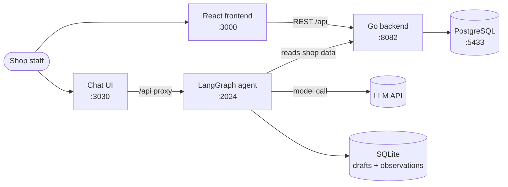

# Taphoa Management

Shop software for a Vietnamese grocery store: point of sale, stock tracked by batch and expiry
date, purchasing, customer debt, revenue and profit reports, expiry and low-stock alerts, and a
chat assistant you can ask questions about the shop's data.

> A personal project, built in phases. Solo build.

---

## Features

- 🛒 **Point of sale** — scan or pick products, take payment, print the receipt, apply discounts.
- 📦 **Products & stock** — categories, unit conversion, stock tracked per **batch** with an
  **expiry date**.
- 🚚 **Purchasing** — purchase orders from suppliers, received stock added as new batches.
- 🔁 **Returns & waste** — return records and write-offs.
- 👥 **Customers & debt** — track what customers owe and record payments.
- 🧾 **Shifts** — open and close a shift, reconcile the till.
- 📊 **Stocktake** — count the shelves, confirm the difference against the system.
- ⚠️ **Alerts** — stock expiring in 7 / 15 / 30 days, and stock below its minimum level, sent by
  **email**.
- 📈 **Reports** — revenue, profit, best sellers, period comparison, with **Excel export**.
- 💬 **Chat assistant** — ask questions about the shop's data in Vietnamese (LangGraph).

---

## Architecture



| Component | Role | Built with | Port |
| --- | --- | --- | --- |
| `backend/` | REST API, business rules, database | Go, Gin, GORM, pgx, JWT | 8082 |
| `frontend/` | Main management UI | React 19, Vite, TypeScript, Ant Design 6, React Query, React Router 7, Recharts | 3000 |
| `agent/` | Chat assistant | LangGraph.js, SQLite | 2024 |
| `chat-ui/` | Chat interface (third-party app) | Next.js — [agent-chat-ui](https://github.com/langchain-ai/agent-chat-ui) | 3030 |
| PostgreSQL | Database | Docker `postgres:16` | 5433 |

> ⚠️ `chat-ui/` is **not** committed to this repo (see `.gitignore`). It is a third-party
> open-source app, cloned separately — see [Chat assistant](#4-chat-assistant-optional).

---

## The hard parts

Most of the code is ordinary CRUD. These three are the parts that took real thought.

**Selling the right batch first.** The same product arrives in batches with different expiry dates,
so a sale cannot just subtract from one number. Each sale walks the batches of that product in
expiry order and draws from the soonest-expiring one first, so stock leaves the shelf before it has
to be written off. Batches with no expiry date at all are sorted **last** rather than first — the
query treats a missing date as the year 9999, so undated stock never jumps ahead of stock that is
actually about to expire.

```go
tx.Where("product_id = ? AND quantity > 0", item.ProductID).
    Order("COALESCE(expiry_date, '9999-12-31') ASC, received_at ASC").
    Find(&batches)
```

**A daily alert that survives a restart.** The shop owner gets one email each morning listing what
is about to expire and what is running low. Rather than depend on system cron, the server runs a
goroutine that works out when the next 7:00 AM in `Asia/Ho_Chi_Minh` is and sleeps until then — so
the schedule is correct regardless of the server's own timezone, and restarting the server
re-arms it instead of skipping a day. If the timezone database is missing it falls back to local
time and says so in the log instead of crashing, if SMTP is not configured it disables itself
instead of failing every morning, and it shuts down cleanly when the server's context is cancelled.

**Deploying it so the shop can actually use it.** `install-service.sh` writes a `systemd` unit so
the server runs as a background service: it starts after PostgreSQL is up (`After=network.target
postgresql.service`) rather than racing it, and restarts automatically five seconds after any crash
(`Restart=always`). The shop needs the till working in the morning whether or not anyone is around
to restart a process.

---

## Tech stack

- **Backend:** Go 1.25 · Gin · GORM · pgx · JWT (`golang-jwt`) · bcrypt.
- **Frontend:** React 19 · Vite · TypeScript · Ant Design 6 · TanStack React Query · React Router 7
  · Recharts · jsbarcode.
- **Agent:** LangGraph.js · better-sqlite3 · Zod.
- **Infrastructure:** Docker Compose (PostgreSQL) · Cloudflare Tunnel (remote access) · systemd.

---

## Repo layout

```
taphoa-management/
├── backend/            # Go API
│   ├── main.go         # entrypoint: connect DB, AutoMigrate, seed admin, start server
│   ├── config/         # database connection
│   ├── models/         # table definitions (GORM models)
│   ├── handlers/       # request handling per API group (product, invoice, alert, report...)
│   ├── routes/         # route declarations + permissions (auth / admin)
│   ├── middleware/     # JWT auth, ...
│   └── services/       # shared logic (email, scheduled jobs...)
├── frontend/           # React app (src/pages/ holds each screen)
├── agent/              # chat agent (LangGraph) — src/graph, src/tools, src/prompts
├── chat-ui/            # cloned separately, not committed
├── docs/               # design notes, research, plans, guides
├── docker-compose.yml  # PostgreSQL
├── install-service.sh  # install the systemd unit for 24/7 running
├── start-all.sh        # DB + backend + frontend (add --tunnel for Cloudflare)
└── start-chat.sh       # agent + chat UI (backend must already be running)
```

---

## Prerequisites

- **Go** ≥ 1.25
- **Node.js** ≥ 20 with **npm** (frontend) and **pnpm** (chat-ui)
- **Docker** + Docker Compose (for PostgreSQL)
- *(optional)* an LLM API key — only needed for the chat assistant
- *(optional)* **cloudflared** — only needed for remote access over a tunnel

---

## Setup

### 1. Database (PostgreSQL via Docker)

```bash
docker compose up -d        # starts postgres:16 on port 5433
```

### 2. Backend (Go) — port 8082

```bash
cd backend
cp .env.example .env        # then fill in the DB and SMTP details
go run main.go
```

On first run the backend **migrates** (creates tables from the models) and **seeds a default admin
account**.

### 3. Frontend (React) — port 3000

```bash
cd frontend
npm install
npm start                   # vite dev server
```

The frontend reads the API address from `frontend/.env.development`
(`REACT_APP_API_URL=http://localhost:8082/api`).

### 4. Chat assistant (optional)

The agent and the chat UI are separate pieces and both need the backend (`:8082`) running.

```bash
# a) Agent
cd agent
cp .env.example .env        # fill in GOOGLE_API_KEY + TAPHOA_PHONE / TAPHOA_PASSWORD
npm install

# b) Chat UI — third-party app, cloned separately (not part of this repo)
git clone https://github.com/langchain-ai/agent-chat-ui chat-ui
cp chat-ui.env.example chat-ui/.env
cd chat-ui && pnpm install && cd ..

# c) Run the agent (:2024) and the chat UI (:3030)
./start-chat.sh
```

### Run everything

```bash
./start-all.sh              # DB + backend + frontend
./start-all.sh --tunnel     # + Cloudflare named tunnel (remote access)
./start-chat.sh             # agent + chat UI (after the backend is up)
sudo ./install-service.sh   # install the systemd unit to run 24/7
```

---

## Environment variables

Each part has its own `.env.example` — copy it to `.env` and fill it in. `.env` files are **not**
committed.

**`backend/.env`**

| Variable | Meaning |
| --- | --- |
| `DB_HOST` `DB_PORT` `DB_USER` `DB_PASSWORD` `DB_NAME` | PostgreSQL connection (local Docker: port `5433`) |
| `PORT` | Backend port (default `8082`) |
| `GIN_MODE` | `release` or `debug` |
| `STATIC_DIR` | Frontend build directory to serve in production |
| `SMTP_EMAIL` `SMTP_PASSWORD` `ALERT_RECIPIENTS` | Sending alert email (use a Gmail App Password) |

**`agent/.env`**

| Variable | Meaning |
| --- | --- |
| `GOOGLE_API_KEY` | API key from [aistudio.google.com](https://aistudio.google.com) |
| `GEMINI_MODEL` | Model to use (default `gemini-2.5-flash`) |
| `TAPHOA_API_URL` | Backend address (`http://localhost:8082`) |
| `TAPHOA_PHONE` `TAPHOA_PASSWORD` | The account the agent logs into the backend with |
| `AGENT_DB_PATH` | The agent's SQLite file (default `data/agent.db`) |
| `LANGSMITH_*` | *(optional)* tracing through LangSmith |

---

## API overview

The REST API sits under `/api` and authenticates with **JWT** (`Authorization: Bearer <token>`).
Routes fall into two permission levels:

- **auth** (any signed-in user): products, categories, suppliers, purchase-orders, invoices,
  returns, shifts, inventory, inventory-checks, waste, customers, debts, alerts.
- **admin** only: registering new users, deleting or voiding records, confirming a stocktake,
  sending alert emails, **reports** and **Excel export**.

| Method | Endpoint | Description |
| --- | --- | --- |
| `POST` | `/api/auth/login` | Sign in, receive a JWT |
| `GET` | `/api/products` | List products (paginated) |
| `POST` | `/api/invoices` | Create an invoice (a sale) |
| `GET` | `/api/alerts/expiry?days=7` | Stock expiring within N days |
| `GET` | `/api/alerts/low-stock` | Stock below its minimum level |
| `GET` | `/api/reports/revenue` | Revenue report *(admin)* |
| `GET` | `/api/reports/revenue/export` | Export revenue to Excel *(admin)* |

> For the full list see `backend/routes/routes.go`.

---

## Documentation

The `docs/` directory holds the detailed material (in Vietnamese):

- `docs/thiet-ke/database-design.md` — database design
- `docs/huong-dan-deploy.md` — deployment guide
- `docs/chat-ui-setup.md` — chat interface setup
- `docs/HUONG-DAN-CONG-SU.md` — onboarding guide for new contributors

---

## Contributing

Work happens through **fork and pull request**:

1. Fork `bangthdev/taphoa-management` to your own account.
2. Create a branch per task.
3. Push to your fork and open a **pull request** against `main`.
4. The project owner reviews and merges.

Step by step: see [`docs/HUONG-DAN-CONG-SU.md`](docs/HUONG-DAN-CONG-SU.md).
