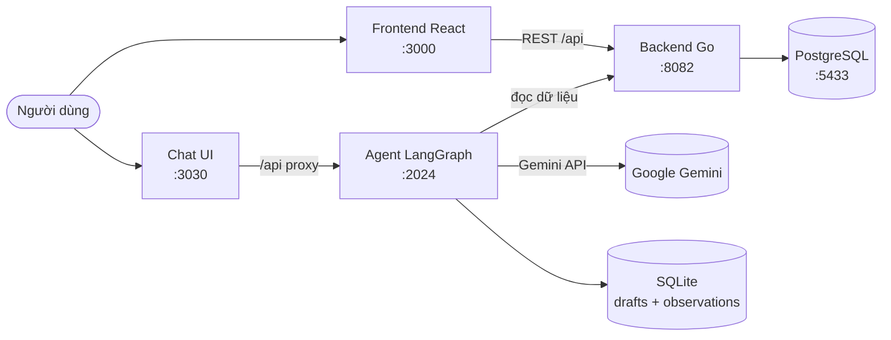

# Taphoa Management

Hệ thống quản lý cửa hàng **tạp hóa**: bán hàng (POS), quản lý kho – lô – hạn sử dụng, nhập hàng, công nợ khách, báo cáo doanh thu/lợi nhuận, cảnh báo hết hạn/sắp hết hàng, kèm một **trợ lý chat AI** trả lời câu hỏi về dữ liệu cửa hàng.

> Dự án cá nhân, đang phát triển theo từng *phase*. Repo nằm trong tổ chức `taphoa-team` trên GitHub.

---

## Tính năng chính

- 🛒 **Bán hàng (POS)** — quét/chọn sản phẩm, tính tiền, in hóa đơn, hỗ trợ giảm giá.
- 📦 **Sản phẩm & kho** — danh mục, đơn vị quy đổi (unit conversion), tồn kho theo **lô** (batch) kèm **hạn sử dụng**.
- 🚚 **Nhập hàng** — đơn nhập (purchase order) từ nhà cung cấp, cập nhật tồn kho theo lô.
- 🔁 **Trả hàng / Xuất hủy** — return và waste record.
- 👥 **Khách hàng & công nợ** — theo dõi nợ, ghi nhận thanh toán.
- 🧾 **Ca làm việc (shift)** — mở/đóng ca, đối soát.
- 📊 **Kiểm kê (inventory check)** — đếm kho thực tế, xác nhận chênh lệch.
- ⚠️ **Cảnh báo** — hàng sắp hết hạn (7/15/30 ngày) + hàng sắp hết kho; gửi cảnh báo qua **email**.
- 📈 **Báo cáo** — doanh thu, lợi nhuận, top sản phẩm, so sánh kỳ; **xuất Excel**.
- 💬 **Trợ lý chat AI** — hỏi đáp về dữ liệu cửa hàng bằng tiếng Việt (LangGraph + Gemini).

---

## Kiến trúc tổng quan



| Thành phần | Vai trò | Công nghệ | Port |
|---|---|---|---|
| `backend/` | REST API + nghiệp vụ + DB | Go, Gin, GORM, pgx, JWT | 8082 |
| `frontend/` | Giao diện quản lý chính | React 19, Vite, TypeScript, Ant Design 6, React Query, React Router 7, Recharts | 3000 |
| `agent/` | Trợ lý chat AI | LangGraph.js, Gemini (`@langchain/google-genai`), SQLite | 2024 |
| `chat-ui/` | Giao diện chat (app bên thứ 3) | Next.js — [agent-chat-ui](https://github.com/langchain-ai/agent-chat-ui) | 3030 |
| PostgreSQL | Cơ sở dữ liệu | Docker `postgres:16` | 5433 |

> ⚠️ `chat-ui/` **không** được commit vào repo (xem `.gitignore`). Nó là app mã nguồn mở bên thứ ba, được **clone riêng** — xem mục [Trợ lý chat AI](#4-trợ-lý-chat-ai-tùy-chọn).

---

## Tech stack

- **Backend:** Go 1.25 · Gin (web framework) · GORM (ORM) · pgx (driver PostgreSQL) · JWT (`golang-jwt`) · bcrypt (hash mật khẩu).
- **Frontend:** React 19 · Vite · TypeScript · Ant Design 6 · TanStack React Query · React Router 7 · Recharts (biểu đồ) · jsbarcode (mã vạch).
- **Agent:** LangGraph.js · Gemini 2.5 Flash · better-sqlite3 · Zod.
- **Hạ tầng:** Docker Compose (PostgreSQL) · Cloudflare Tunnel (truy cập từ xa).

---

## Cấu trúc thư mục

```
taphoa-management/
├── backend/            # API Go
│   ├── main.go         # entrypoint: kết nối DB, AutoMigrate, seed admin, start server
│   ├── config/         # kết nối database
│   ├── models/         # định nghĩa bảng (GORM models)
│   ├── handlers/       # xử lý request từng nhóm API (product, invoice, alert, report...)
│   ├── routes/         # khai báo route + phân quyền (auth / admin)
│   ├── middleware/     # JWT auth, ...
│   └── services/       # logic dùng chung (email, scheduled jobs...)
├── frontend/           # React app (thư mục src/pages/ chứa từng trang)
├── agent/              # Chat agent (LangGraph) — src/graph, src/tools, src/prompts
├── chat-ui/            # (clone riêng, không commit) giao diện chat
├── docs/               # tài liệu thiết kế, khảo sát, kế hoạch, hướng dẫn
├── docker-compose.yml  # PostgreSQL
├── start-all.sh        # chạy DB + backend + frontend (thêm --tunnel để mở Cloudflare)
└── start-chat.sh       # chạy agent + chat UI (cần backend đang chạy)
```

---

## Yêu cầu (prerequisites)

- **Go** ≥ 1.25
- **Node.js** ≥ 20 + **npm** (frontend) và **pnpm** (chat-ui)
- **Docker** + Docker Compose (chạy PostgreSQL)
- (Tùy chọn) **Google Gemini API key** — chỉ cần khi dùng trợ lý chat AI
- (Tùy chọn) **cloudflared** — chỉ cần khi muốn truy cập từ xa qua tunnel

---

## Cài đặt & chạy

### 1. Cơ sở dữ liệu (PostgreSQL qua Docker)

```bash
docker compose up -d        # khởi động postgres:16 ở port 5433
```

### 2. Backend (Go) — port 8082

```bash
cd backend
cp .env.example .env        # rồi sửa thông tin DB, SMTP nếu cần
go run main.go
```

Khi chạy lần đầu, backend tự **migrate** (tạo bảng từ models) và **seed một tài khoản admin mặc định**.

### 3. Frontend (React) — port 3000

```bash
cd frontend
npm install
npm start                   # vite dev server
```

Frontend đọc địa chỉ API từ `frontend/.env.development` (`REACT_APP_API_URL=http://localhost:8082/api`).

### 4. Trợ lý chat AI (tùy chọn)

Agent + Chat UI là 2 phần tách rời, cần backend (`:8082`) đang chạy.

```bash
# a) Agent
cd agent
cp .env.example .env        # điền GOOGLE_API_KEY + TAPHOA_PHONE/PASSWORD
npm install

# b) Chat UI — app bên thứ 3, clone riêng (không nằm trong repo)
git clone https://github.com/langchain-ai/agent-chat-ui chat-ui
cp chat-ui.env.example chat-ui/.env
cd chat-ui && pnpm install && cd ..

# c) Chạy cả agent (:2024) + chat UI (:3030)
./start-chat.sh
```

### Chạy nhanh tất cả

```bash
./start-all.sh              # DB + backend + frontend
./start-all.sh --tunnel     # + Cloudflare named tunnel (truy cập từ xa)
./start-chat.sh             # agent + chat UI (chạy sau khi backend đã lên)
```

---

## Biến môi trường

Mỗi phần có file `.env.example` riêng — copy thành `.env` rồi điền. (Các file `.env` **không** được commit.)

**`backend/.env`**

| Biến | Ý nghĩa |
|---|---|
| `DB_HOST` `DB_PORT` `DB_USER` `DB_PASSWORD` `DB_NAME` | Kết nối PostgreSQL (local Docker: port `5433`) |
| `PORT` | Cổng backend (mặc định `8082`) |
| `GIN_MODE` | `release` hoặc `debug` |
| `STATIC_DIR` | Thư mục build frontend để serve khi chạy production |
| `SMTP_EMAIL` `SMTP_PASSWORD` `ALERT_RECIPIENTS` | Gửi email cảnh báo (dùng Gmail App Password) |

**`agent/.env`**

| Biến | Ý nghĩa |
|---|---|
| `GOOGLE_API_KEY` | API key Gemini ([aistudio.google.com](https://aistudio.google.com)) |
| `GEMINI_MODEL` | Model dùng (mặc định `gemini-2.5-flash`) |
| `TAPHOA_API_URL` | Địa chỉ backend (`http://localhost:8082`) |
| `TAPHOA_PHONE` `TAPHOA_PASSWORD` | Tài khoản agent dùng để đăng nhập backend |
| `AGENT_DB_PATH` | File SQLite của agent (mặc định `data/agent.db`) |
| `LANGSMITH_*` | (Tùy chọn) tracing qua LangSmith |

---

## Tổng quan API

REST API dưới prefix `/api`, xác thực bằng **JWT** (header `Authorization: Bearer <token>`). Route chia 2 mức quyền:

- **auth** (đăng nhập là dùng được): products, categories, suppliers, purchase-orders, invoices, returns, shifts, inventory, inventory-checks, waste, customers, debts, alerts.
- **admin** (chỉ admin): đăng ký user mới, xóa/hủy bản ghi, xác nhận kiểm kê, gửi email cảnh báo, **báo cáo** và **xuất Excel**.

| Method | Endpoint | Mô tả |
|---|---|---|
| `POST` | `/api/auth/login` | Đăng nhập, nhận JWT |
| `GET` | `/api/products` | Danh sách sản phẩm (có phân trang) |
| `POST` | `/api/invoices` | Tạo hóa đơn (bán hàng) |
| `GET` | `/api/alerts/expiry?days=7` | Hàng sắp hết hạn trong N ngày |
| `GET` | `/api/alerts/low-stock` | Hàng dưới mức tồn tối thiểu |
| `GET` | `/api/reports/revenue` | Báo cáo doanh thu *(admin)* |
| `GET` | `/api/reports/revenue/export` | Xuất Excel doanh thu *(admin)* |

> Danh sách đầy đủ xem `backend/routes/routes.go`.

---

## Tài liệu

Thư mục `docs/` chứa tài liệu chi tiết:

- `docs/thiet-ke/database-design.md` — thiết kế cơ sở dữ liệu
- `docs/huong-dan-deploy.md` — hướng dẫn deploy
- `docs/chat-ui-setup.md` — cài đặt giao diện chat
- `docs/HUONG-DAN-CONG-SU.md` — **hướng dẫn cho người mới tham gia đóng góp code**

---

## Đóng góp

Repo là **private**. Người đóng góp được cấp quyền **Read**, làm việc theo mô hình **Fork + Pull Request**:

1. Fork repo `taphoa-team/taphoa-management` về tài khoản của bạn.
2. Tạo nhánh riêng cho mỗi task.
3. Push lên fork → mở **Pull Request** vào `main`.
4. Chủ dự án review và merge.

Chi tiết từng bước: xem [`docs/HUONG-DAN-CONG-SU.md`](docs/HUONG-DAN-CONG-SU.md).
