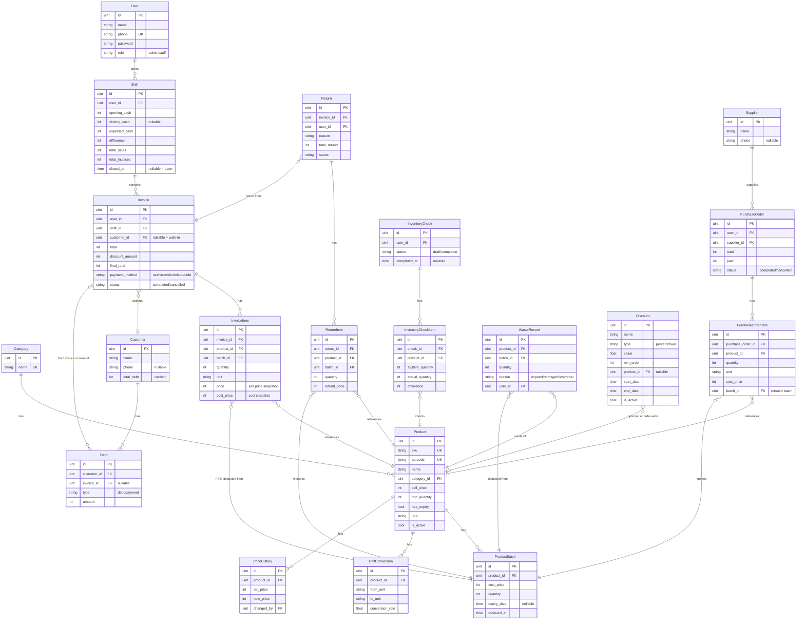

# Taphoa Management — Knowledge Graph

> Bản đồ codebase để navigate nhanh. Cập nhật khi có thay đổi lớn.

## 1. Project Overview

```
taphoa-management/
├── backend/          # Go + Gin + GORM (REST API, port 8082)
├── frontend/         # React 19 + Vite + Ant Design 6 + React Query 5
├── docs/             # Documentation & plans
├── docker-compose.yml  # PostgreSQL 16 (port 5433)
├── deploy.sh         # Build frontend + backend → taphoa-server binary
├── start-all.sh      # Dev: Docker DB + Backend + Frontend + optional tunnel
└── TODO.md           # Master checklist (Phase 0-6)
```

---

## 2. Database — Entity Relationship Graph



**20 tables** tổng cộng. Tất cả auto-migrate từ GORM models.

---

## 3. Backend Architecture

### 3.1 File Map

```
backend/
├── main.go                    # Entry: DB connect → migrate → seed → CORS → scheduler → routes → serve
├── config/database.go         # PostgreSQL connection (pool: 10 idle, 25 max, 5min lifetime)
├── middleware/auth.go         # JWT (HS256, 24h), AuthRequired, AdminRequired
├── routes/routes.go           # 68 endpoints registration
├── models/                    # 19 GORM model files
│   ├── user.go               # User (admin/staff)
│   ├── category.go
│   ├── product.go             # + Batches, UnitConversions relations
│   ├── product_batch.go       # FIFO stock tracking
│   ├── unit_conversion.go
│   ├── supplier.go
│   ├── purchase_order.go      # + Items relation
│   ├── purchase_order_item.go
│   ├── invoice.go             # + Items relation, indexed by shift+status
│   ├── invoice_item.go        # Tracks batch_id for traceability
│   ├── return.go              # + Items relation
│   ├── return_item.go
│   ├── shift.go               # Indexed by user+closed_at
│   ├── inventory_check.go     # + Items (InventoryCheckItem in same file)
│   ├── waste_record.go
│   ├── customer.go            # total_debt cached field
│   ├── debt.go                # type: debt/payment
│   ├── price_history.go
│   └── discount.go            # percent/fixed, order-wide or per-product
├── handlers/
│   ├── helpers.go             # paginate(), parseID(), formatVND()
│   ├── auth.go                # Login, Register, Me
│   ├── categories.go          # CRUD
│   ├── products.go            # CRUD + deactivate, convertToBaseQuantity()
│   ├── suppliers.go           # CRUD
│   ├── purchase_orders.go     # Create (→ creates batches), Cancel
│   ├── invoices.go            # Create (FIFO deduct, debt), Cancel (refund stock)
│   ├── returns.go             # Create (validate qty, refund to batch)
│   ├── shifts.go              # Open (SELECT FOR UPDATE), Close, Current
│   ├── customers.go           # CRUD + debt-payment
│   ├── alerts.go              # Expiry, Low-stock, Summary, Send email
│   ├── inventory.go           # Stock levels
│   ├── inventory_checks.go    # Create draft, Update items, Confirm
│   ├── waste.go               # Record waste (atomic deduct)
│   ├── reports.go             # Revenue, Profit, TopProducts, Compare + Excel exports
│   └── price_history.go       # Get history for product
├── services/
│   ├── email.go               # SendAlertEmail(), GetStockMap(), HTML builder
│   └── scheduler.go           # Daily 7:00 AM VN time alert scheduler
└── .env.example
```

### 3.2 API Endpoints (68 total)

| Group | Endpoints | Auth | Notes |
|-------|-----------|------|-------|
| Health | `GET /health` | Public | |
| Auth | `POST /auth/login`, `GET /auth/me`, `POST /auth/register` | Public / Protected / Admin | |
| Categories | CRUD `/api/categories` | Protected (DELETE=Admin) | |
| Products | CRUD `/api/products` + `/conversions` + `/batches` + `/price-history` | Protected (PATCH deactivate=Admin) | |
| Suppliers | CRUD `/api/suppliers` | Protected (DELETE=Admin) | |
| Purchase Orders | CRD `/api/purchase-orders` | Protected (CANCEL=Admin) | Creates batches on POST |
| Shifts | `/api/shifts` (list, current, open, close) | Protected | SELECT FOR UPDATE |
| Invoices | CRD `/api/invoices` | Protected (CANCEL=Admin) | FIFO deduct, debt |
| Returns | CR `/api/returns` | Protected | Validates qty, refund |
| Alerts | `/api/alerts` (expiry, low-stock, summary, send-email) | Protected (send=Admin) | |
| Inventory | `/api/inventory`, `/api/inventory-checks` | Protected (confirm=Admin) | |
| Waste | CR `/api/waste` | Protected | Atomic deduct |
| Customers | CRUD `/api/customers` + debt-payment | Protected | |
| Debts | `GET /api/debts/summary` | Protected | |
| Reports | `/api/reports` (revenue, profit, top-products, compare + exports) | Admin only | Excel via excelize |

### 3.3 Critical Business Logic

| Pattern | Where | How |
|---------|-------|-----|
| **FIFO Deduction** | `handlers/invoices.go` | `ORDER BY COALESCE(expiry_date, '9999-12-31') ASC, received_at ASC` |
| **Atomic Stock** | invoices, waste | `UPDATE SET qty = qty - ? WHERE id = ? AND qty >= ?` + check RowsAffected |
| **Race Prevention** | shifts | `SELECT FOR UPDATE` when opening shift |
| **Unit Conversion** | invoices, purchases | `convertToBaseQuantity()` — converts thùng→chai etc. |
| **Debt Tracking** | invoices, returns | Auto-create Debt record, update Customer.TotalDebt |
| **Safe Delete** | categories, suppliers | TX: COUNT related → DELETE only if 0 |

---

## 4. Frontend Architecture

### 4.1 File Map

```
frontend/src/
├── App.tsx                    # Routes + Theme + QueryClient + AuthProvider
├── index.tsx                  # React root, Suspense wrapper
├── index.css                  # Global styles
│
├── contexts/
│   ├── AuthContext.ts         # AuthContextType definition
│   ├── AuthProvider.tsx       # Auth state + login/logout + token check
│   └── useAuth.ts             # useAuth() hook
│
├── components/
│   ├── AppLayout.tsx          # Sidebar + Header + Breadcrumbs + Content area
│   ├── ProtectedRoute.tsx     # Redirect to /login if not auth
│   ├── ErrorBoundary.tsx      # Catch React errors
│   └── common/
│       ├── PageHeader.tsx     # Title + subtitle + action button (memo)
│       ├── EmptyState.tsx     # "No data" UI with optional action
│       └── Breadcrumbs.tsx    # Auto-generated from route (memo)
│
├── hooks/
│   ├── useApi.ts              # ALL React Query hooks (queries + mutations)
│   ├── useDebounce.ts         # Debounce value (300ms default)
│   ├── usePagination.ts       # Client-side pagination
│   ├── useToggle.ts           # Boolean toggle
│   ├── useLocalStorage.ts     # Sync state ↔ localStorage
│   ├── usePrevious.ts         # Previous value tracker
│   ├── useOnClickOutside.ts   # Outside click detection
│   └── index.ts               # Re-exports
│
├── services/
│   └── api.ts                 # Axios instance, JWT interceptor, 401 redirect
│
├── pages/                     # All lazy-loaded via React.lazy()
│   ├── LoginPage.tsx          # /login — phone + password
│   ├── DashboardPage.tsx      # / — summary cards, charts, alerts
│   ├── AlertsPage.tsx         # /alerts — expiry + low-stock warnings
│   ├── ProductsPage.tsx       # /products — CRUD table + modals
│   ├── CategoriesPage.tsx     # /categories — CRUD
│   ├── SuppliersPage.tsx      # /suppliers — CRUD
│   ├── CustomersPage.tsx      # /customers — list + search
│   ├── CustomerDetailPage.tsx # /customers/:id — profile, invoices, debts
│   ├── InvoicesPage.tsx       # /invoices — paginated list
│   ├── InvoiceDetailPage.tsx  # /invoices/:id — full detail view
│   ├── ShiftsPage.tsx         # /shifts — open/close, cash reconciliation
│   ├── PurchaseOrdersPage.tsx # /purchase-orders — create POs
│   ├── InventoryPage.tsx      # /inventory — stock levels
│   ├── InventoryChecksPage.tsx# /inventory-checks — physical counts
│   ├── WastePage.tsx          # /waste — log waste
│   ├── ReturnsPage.tsx        # /returns — process returns
│   ├── DebtsPage.tsx          # /debts — debt summary
│   ├── POSPage.tsx            # /pos — full-screen checkout (no sidebar)
│   └── ReportsPage.tsx        # /reports — admin only, charts + export
│
├── types/
│   └── index.ts               # 80+ TypeScript interfaces (mirrors Go models)
│
├── utils/
│   ├── index.ts               # Re-exports
│   ├── format.ts              # formatVND, formatDate, formatDateTime, getErrorMessage, escapeHtml
│   └── memo.ts                # memoEqual, useStableObject, useTableColumns
│
├── constants/
│   └── index.ts               # PAGE_SIZE, DEBOUNCE_DELAY, PAYMENT_METHODS, BREAKPOINTS, etc.
│
└── styles/
    └── common.ts              # CSS-in-JS: flex utils, page layouts, POS styles
```

### 4.2 React Query — Cache Key Structure

```
queryKeys = {
  invoices:       ['invoices', ...]      → all, today, list(params), detail(id)
  shifts:         ['shifts', ...]        → all, list(limit), current
  products:       ['products', ...]      → all, list(params), detail(id), batches(id), priceHistory(id), conversions(id)
  categories:     ['categories']
  customers:      ['customers', ...]     → all, list(params), detail(id)
  suppliers:      ['suppliers']
  alerts:         ['alerts', ...]        → all, summary, lowStock, expiry(days, limit)
  purchaseOrders: ['purchaseOrders', ...] → all, list(page), detail(id)
  inventory:      ['inventory', ...]     → all, list(search)
  inventoryChecks:['inventoryChecks', ...] → all, detail(id)
  waste:          ['waste', ...]         → all, list(page)
  returns:        ['returns', ...]       → all, list(page)
  debts:          ['debts']
  reports:        ['reports', ...]       → revenue, profit, compare, topProducts
}
```

Mutations auto-invalidate related keys on success.

### 4.3 Data Flow

```
User Action → Page Component
                 ↓
           useXxx() hook (useApi.ts)
                 ↓
           React Query (cache + fetch)
                 ↓
           api.get/post/put/delete (services/api.ts)
                 ↓
           Axios → JWT header injected → Backend API
                 ↓
           Response → cache updated → UI re-renders
```

### 4.4 Theme

- Primary: `#0d9488` (Teal 600)
- Border radius: 10px (global), 8px (buttons), 12px (cards)
- Control height: 36px (global), 40px (buttons)
- Locale: Vietnamese (`antd/locale/vi_VN`)
- All pages lazy-loaded with `React.lazy()` + `Suspense`

---

## 5. Key Data Flows

### Sale (Invoice Creation)
```
Shift open? → For each item: convert unit → get price → FIFO deduct batches
→ Create InvoiceItems with batch_id → Calculate total/discount/final
→ If debt: create Debt + update Customer.TotalDebt → TX commit
```

### Purchase Order
```
For each item: convert unit → create ProductBatch → create PO Item with batch_id
→ Sum total → TX commit → Stock now available
```

### Return
```
Validate invoice exists → Map sold qty by (product, batch) → Subtract already returned
→ Validate requested ≤ available → Add stock back to batch → Create Debt refund → TX commit
```

---

## 6. Environment & Deployment

| Var | Default | Purpose |
|-----|---------|---------|
| `DB_HOST` | localhost | PostgreSQL host |
| `DB_PORT` | 5432 (docker: 5433) | PostgreSQL port |
| `DB_USER` | postgres | DB user |
| `DB_PASSWORD` | changeme | DB password |
| `DB_NAME` | taphoa | Database name |
| `PORT` | 8082 | Backend HTTP port |
| `GIN_MODE` | debug | release for production |
| `JWT_SECRET` | (dev fallback) | REQUIRED in production |
| `FRONTEND_URL` | — | CORS allowed origin |
| `SMTP_EMAIL` | — | Gmail for alerts |
| `SMTP_PASSWORD` | — | Gmail app password |
| `ALERT_RECIPIENTS` | — | Comma-separated emails |
| `VITE_API_URL` | /api | Frontend API base URL |

### Deploy: `deploy.sh` → build FE + BE → single `taphoa-server` binary → systemd service

---

## 7. Quick Lookup — "Where is X?"

| Looking for... | Go to... |
|----------------|----------|
| Add new API endpoint | `backend/routes/routes.go` → `backend/handlers/` |
| Add new model/table | `backend/models/` → add to `AutoMigrate` in `main.go` |
| Add new page | `frontend/src/pages/` → add route in `App.tsx` → add menu in `AppLayout.tsx` |
| Add React Query hook | `frontend/src/hooks/useApi.ts` |
| Add utility function | `frontend/src/utils/` |
| Add TypeScript type | `frontend/src/types/index.ts` |
| Change theme/colors | `frontend/src/App.tsx` (theme config) |
| Change sidebar menu | `frontend/src/components/AppLayout.tsx` → `getMenuItems()` |
| Add constant | `frontend/src/constants/index.ts` |
| Debug auth issues | `backend/middleware/auth.go` + `frontend/src/contexts/AuthProvider.tsx` |
| DB connection issues | `backend/config/database.go` + `.env` |
| Stock calculation | `backend/services/email.go` → `GetStockMap()` |
| FIFO logic | `backend/handlers/invoices.go` → look for `ORDER BY COALESCE(expiry_date` |
| Email alerts | `backend/services/email.go` + `scheduler.go` |
| Excel exports | `backend/handlers/reports.go` |
