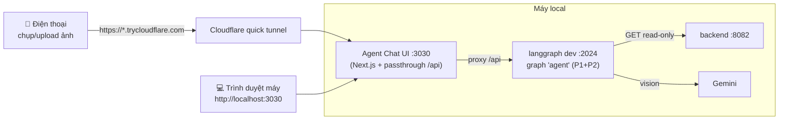

# Taphoa Chat Agent — Phase 3 Implementation Plan

> **For agentic workers:** Task 1 (code) follows TDD and can be run via superpowers:subagent-driven-development. Tasks 2-6 are environment setup / manual verification done interactively with the user (clone repo, run dev servers, test on phone) — they are NOT subagent/TDD tasks. Steps use checkbox (`- [ ]`) syntax.

**Goal:** Có giao diện chat web đẹp (Agent Chat UI của LangChain) nối với agent taphoa: chat hỏi-đáp + **upload ảnh hóa đơn** (kéo-thả trên máy, hoặc chụp trực tiếp trên điện thoại qua Cloudflare tunnel).

**Architecture:** Clone `langchain-ai/agent-chat-ui` (Next.js) chạy local ở `:3030`, nối tới `langgraph dev` (`:2024`) qua **API passthrough** (Next.js proxy `/api` → `:2024`) → chỉ cần **1 tunnel** tới UI, không phải expose `:2024`, không lo CORS. Một thay đổi code nhỏ trong agent: **chuẩn hóa block ảnh** mà UI gửi (`{type:"image", mimeType, data}`) về dạng `image_url` data-URI mà Gemini chắc chắn đọc được.

**Tech Stack:** agent-chat-ui (Next.js, **pnpm**), Cloudflare `cloudflared` (đã có hạ tầng named tunnel `taphoa`/`bangth.org`), agent LangGraph.js Phase 1+2 (`:2024`), backend taphoa (`:8082`).

> **Spec gốc:** `docs/superpowers/specs/2026-05-25-taphoa-chat-agent-design.md` (mục 8 — giao diện & cách chạy).
> **Phase này KHÔNG bao gồm:** human-in-the-loop `interrupt` biến nháp thành đơn nhập thật (v2), Telegram/Zalo (v2), branding nặng (chỉ đổi tên/tiêu đề nhẹ nếu kịp).

---

## Bối cảnh đã verify (research 2026-05-27)

- **agent-chat-ui**: `pnpm install` → `pnpm dev` (mặc định `:3000`, **trùng frontend taphoa** → ta chạy `:3030`). Có sẵn upload đa phương tiện (`src/lib/multimodal-utils.ts`, `MultimodalPreview.tsx`). Env: `NEXT_PUBLIC_API_URL`, `NEXT_PUBLIC_ASSISTANT_ID`, `NEXT_PUBLIC_AUTH_SCHEME`, `LANGGRAPH_API_URL` (passthrough), `LANGSMITH_API_KEY` (server-side, optional).
- **Tên graph của ta = `agent`** (trong `agent/langgraph.json`) → `NEXT_PUBLIC_ASSISTANT_ID=agent`.
- **Format ảnh UI gửi** (từ `multimodal-utils.ts`): `{ type:"image", mimeType, data, metadata }` cho ảnh; `{ type:"file", mimeType:"application/pdf", data }` cho PDF. Chấp nhận `image/jpeg|png|gif|webp` + `application/pdf`. ⚠️ Đây KHÔNG phải format chuẩn của `@langchain/google-genai` → **cần chuẩn hóa** (Task 1).
- **Tunnel sẵn có**: `cloudflared`. Quick tunnel: `cloudflared tunnel --url http://localhost:3030` → URL `*.trycloudflare.com` (0 cấu hình DNS — hợp để test ngay). Named tunnel `taphoa` (domain cố định) là tùy chọn nâng cao sau.



---

## File Structure (Phase 3)

```
taphoa-management/
├── agent/
│   ├── src/graph/
│   │   ├── normalize.ts          # NEW: chuẩn hóa block ảnh UI → image_url data-URI (Task 1)
│   │   └── graph.ts              # MODIFY: agentNode dùng normalizeMessageContent (Task 1)
│   └── test/
│       └── normalize.test.ts     # NEW (Task 1)
├── chat-ui/                       # NEW: clone agent-chat-ui (GITIGNORED — app bên thứ 3)
│   └── .env                       # NEW: cấu hình trỏ tới :2024 (gitignored cùng chat-ui/)
├── start-chat.sh                  # NEW: launcher (langgraph dev + chat UI [+ --tunnel]) (Task 3,5)
├── chat-ui.env.example            # NEW: mẫu .env cho chat-ui (tracked, để tái lập) (Task 2)
├── .gitignore                     # MODIFY (root): thêm chat-ui/ (Task 2)
└── docs/chat-ui-setup.md          # NEW: hướng dẫn chạy UI (Task 6)
```

---

## Task 1: Chuẩn hóa ảnh đầu vào trong agent (CODE — TDD, subagent-able)

**Files:**
- Test: `agent/test/normalize.test.ts`
- Create: `agent/src/graph/normalize.ts`
- Modify: `agent/src/graph/graph.ts`

> **Vì sao:** UI gửi ảnh dạng `{type:"image", mimeType, data}` — `@langchain/google-genai` không chắc hiểu. Ta map nó về `{type:"image_url", image_url:{url:"data:<mime>;base64,<data>"}}` (đúng dạng `scripts/invoice.ts` đã dùng & verify với Gemini). Hàm thuần, idempotent, để cả CLI lẫn UI cùng 1 đường dữ liệu. Chỉ đụng `HumanMessage`; bỏ qua text/ảnh-đã-đúng-dạng; PDF để nguyên (best-effort, ngoài phạm vi flagship ảnh).

- [ ] **Step 1: Viết test thất bại** — `agent/test/normalize.test.ts`

```ts
import { describe, it, expect } from "vitest";
import { HumanMessage, AIMessage } from "@langchain/core/messages";
import { normalizeImageBlock, normalizeMessageContent } from "../src/graph/normalize";

describe("normalizeImageBlock", () => {
  it("block ảnh kiểu agent-chat-ui → image_url data-URI", () => {
    const out = normalizeImageBlock({ type: "image", mimeType: "image/png", data: "AAAA", metadata: { name: "x" } });
    expect(out).toEqual({ type: "image_url", image_url: { url: "data:image/png;base64,AAAA" } });
  });

  it("block text giữ nguyên", () => {
    const t = { type: "text", text: "xin chào" };
    expect(normalizeImageBlock(t)).toEqual(t);
  });

  it("block image_url đã đúng dạng → giữ nguyên (idempotent)", () => {
    const b = { type: "image_url", image_url: { url: "data:image/jpeg;base64,ZZ" } };
    expect(normalizeImageBlock(b)).toEqual(b);
  });

  it("ảnh thiếu mimeType → mặc định image/jpeg", () => {
    const out = normalizeImageBlock({ type: "image", data: "BBBB" });
    expect(out).toEqual({ type: "image_url", image_url: { url: "data:image/jpeg;base64,BBBB" } });
  });
});

describe("normalizeMessageContent", () => {
  it("HumanMessage content mảng: ảnh được convert, text giữ; AIMessage không đụng", () => {
    const human = new HumanMessage({
      content: [
        { type: "text", text: "ghi đơn này" },
        { type: "image", mimeType: "image/jpeg", data: "IMG" },
      ],
    });
    const ai = new AIMessage("ok");
    const out = normalizeMessageContent([human, ai]);

    expect(out[0].getType()).toBe("human");
    expect(out[0].content).toEqual([
      { type: "text", text: "ghi đơn này" },
      { type: "image_url", image_url: { url: "data:image/jpeg;base64,IMG" } },
    ]);
    expect(out[1]).toBe(ai); // AIMessage giữ nguyên tham chiếu
  });

  it("HumanMessage content string giữ nguyên", () => {
    const human = new HumanMessage("tồn kho coca?");
    const out = normalizeMessageContent([human]);
    expect(out[0].content).toBe("tồn kho coca?");
  });
});
```

- [ ] **Step 2: Chạy test → FAIL**

Run: `cd agent && npx vitest run test/normalize.test.ts`
Expected: FAIL — `Cannot find module '../src/graph/normalize'`.

- [ ] **Step 3: Implement** — `agent/src/graph/normalize.ts`

```ts
import { HumanMessage, type BaseMessage } from "@langchain/core/messages";

type Block = Record<string, unknown>;

/**
 * Chuẩn hóa 1 content block về dạng @langchain/google-genai chắc chắn đọc được.
 * - agent-chat-ui gửi ảnh: { type:"image", mimeType, data, metadata }
 * - ta map → { type:"image_url", image_url:{ url:"data:<mime>;base64,<data>" } }
 * Block khác (text, image_url đã đúng dạng, file/pdf) → giữ nguyên.
 */
export function normalizeImageBlock(block: Block): Block {
  if (block?.type === "image" && typeof block.data === "string" && !block.data.startsWith("data:")) {
    const mime = (block.mimeType as string) ?? (block.mime_type as string) ?? "image/jpeg";
    return { type: "image_url", image_url: { url: `data:${mime};base64,${block.data}` } };
  }
  return block;
}

/**
 * Áp normalizeImageBlock cho mọi HumanMessage có content dạng mảng.
 * Message khác (AI/Tool/System) và HumanMessage content string → giữ nguyên.
 * Chỉ tạo bản sao tạm để đưa vào LLM; KHÔNG thay state gốc.
 */
export function normalizeMessageContent(messages: BaseMessage[]): BaseMessage[] {
  return messages.map((m) => {
    if (m.getType() === "human" && Array.isArray(m.content)) {
      const content = (m.content as Block[]).map(normalizeImageBlock);
      // content là block thô từ wire (loose-typed) → cast qua kiểu content mà HumanMessage chấp nhận.
      return new HumanMessage({ content: content as unknown as HumanMessage["content"] });
    }
    return m;
  });
}
```

- [ ] **Step 4: Wire vào `agent/src/graph/graph.ts`**

Thêm import (sau dòng import `buildSystemMessage`):
```ts
import { normalizeMessageContent } from "./normalize.js";
```

Trong `agentNode`, đổi dòng:
```ts
  const response = await llmWithTools.invoke([buildSystemMessage(), ...state.messages]);
```
thành:
```ts
  const response = await llmWithTools.invoke([buildSystemMessage(), ...normalizeMessageContent(state.messages)]);
```

- [ ] **Step 5: Chạy test + full suite + typecheck**

Run: `cd agent && npx vitest run test/normalize.test.ts && npm test && npx tsc --noEmit`
Expected: normalize test PASS; full suite PASS (cũ 19 + mới 6 = 25); no type errors.

- [ ] **Step 6: Commit**

```bash
cd agent && git add src/graph/normalize.ts src/graph/graph.ts test/normalize.test.ts && git commit -m "feat: normalize UI image blocks for gemini multimodal input"
```
Commit rules: English, imperative; KHÔNG `Co-Authored-By`/AI attribution.

---

## Task 2: Clone agent-chat-ui + cấu hình (setup — chạy tay)

**Files:**
- Create: `chat-ui/` (clone, gitignored)
- Create: `chat-ui/.env`
- Create: `chat-ui.env.example` (tracked)
- Modify: root `.gitignore`

- [ ] **Step 1: Đảm bảo có pnpm** (Node 24 có corepack sẵn)

Run: `corepack enable pnpm` (hoặc `npm install -g pnpm` nếu corepack không có). Kiểm: `pnpm --version`.

- [ ] **Step 2: Clone vào `chat-ui/`** (ở repo root, cạnh `agent/`)

Run:
```bash
cd ~/Documents/taphoa-management && git clone https://github.com/langchain-ai/agent-chat-ui.git chat-ui && cd chat-ui && pnpm install
```
Expected: clone xong, `pnpm install` không lỗi.

- [ ] **Step 3: Gitignore `chat-ui/`** — thêm vào ROOT `.gitignore`:
```
# Agent Chat UI (app bên thứ 3 — clone, không commit; xem chat-ui.env.example + start-chat.sh)
chat-ui/
```

- [ ] **Step 4: Tạo `chat-ui/.env`** (passthrough — dùng cho cả local lẫn tunnel, tránh CORS):
```
# UI gọi proxy nội bộ /api (cùng origin) → không lo CORS, dùng được khi tunnel
NEXT_PUBLIC_API_URL=/api
# Server-side proxy forward tới langgraph dev local
LANGGRAPH_API_URL=http://localhost:2024
# Tên graph của agent taphoa
NEXT_PUBLIC_ASSISTANT_ID=agent
# Local dev server không cần auth
NEXT_PUBLIC_AUTH_SCHEME=
# (Tùy chọn) tracing LangSmith — KHÔNG prefix NEXT_PUBLIC_
LANGSMITH_API_KEY=
```

> **Fallback nếu passthrough lỗi với dev server:** đổi `NEXT_PUBLIC_API_URL=http://localhost:2024` và bỏ `LANGGRAPH_API_URL` (gọi trực tiếp; chỉ chạy local, có thể vướng CORS — nếu vướng thì quay lại passthrough).

- [ ] **Step 5: Tạo `chat-ui.env.example`** (tracked, ở repo root) — copy y nội dung `.env` trên để tái lập được sau này.

- [ ] **Step 6: Commit phần tracked**
```bash
cd ~/Documents/taphoa-management && git add .gitignore chat-ui.env.example && git commit -m "chore: add agent chat ui env template and gitignore the clone"
```

---

## Task 3: Launcher script `start-chat.sh` (setup)

**Files:**
- Create: `start-chat.sh` (repo root, tracked)

- [ ] **Step 1: Tạo `start-chat.sh`**

```bash
#!/bin/bash
# Chạy agent (langgraph dev :2024) + Agent Chat UI (:3030).
# Thêm --tunnel để mở quick Cloudflare tunnel cho điện thoại.
# Cần: backend taphoa đang chạy (:8082), agent/.env có GOOGLE_API_KEY + TAPHOA_*.
set -e
PROJECT_DIR="$HOME/Documents/taphoa-management"
UI_PORT=3030
TUNNEL=false
[ "$1" = "--tunnel" ] && TUNNEL=true

# 1. Kiểm backend
if ! curl -s http://localhost:8082/health > /dev/null; then
  echo "Backend chưa chạy (:8082). Chạy taphoa-all trước."; exit 1
fi

# 2. langgraph dev (agent) :2024
echo "[1/3] Starting agent (langgraph dev :2024)..."
(cd "$PROJECT_DIR/agent" && npm run dev) &
LG_PID=$!

# 3. Chat UI :3030
echo "[2/3] Starting chat UI (:$UI_PORT)..."
(cd "$PROJECT_DIR/chat-ui" && PORT=$UI_PORT pnpm dev) &
UI_PID=$!

PIDS="$LG_PID $UI_PID"

# 4. Tunnel (tùy chọn)
if $TUNNEL; then
  echo "[3/3] Starting Cloudflare quick tunnel → :$UI_PORT ..."
  cloudflared tunnel --url "http://localhost:$UI_PORT" &
  PIDS="$PIDS $!"
  echo "  (URL *.trycloudflare.com sẽ hiện trong log cloudflared ở trên — mở trên điện thoại)"
fi

echo "================================"
echo "  Chat UI:    http://localhost:$UI_PORT"
echo "  LangGraph:  http://localhost:2024"
echo "  Ctrl+C để dừng tất cả"
echo "================================"

cleanup() { echo "Stopping..."; kill $PIDS 2>/dev/null; }
trap cleanup SIGINT SIGTERM
wait
```

- [ ] **Step 2: `chmod +x start-chat.sh`**

- [ ] **Step 3: Commit**
```bash
cd ~/Documents/taphoa-management && git add start-chat.sh && git commit -m "chore: add launcher for agent chat ui and langgraph dev server"
```

---

## Task 4: Verify LOCAL — chat + ảnh (manual, chạy chung với user)

> Cần: backend `:8082` chạy (`taphoa-all`), `agent/.env` có `GOOGLE_API_KEY` + `TAPHOA_PHONE/PASSWORD`.

- [ ] **Step 1: Chạy** `bash start-chat.sh` → đợi UI lên `http://localhost:3030`.
- [ ] **Step 2: Mở** `http://localhost:3030`. Nếu UI hỏi cấu hình, điền API URL + Assistant ID `agent` (nếu `.env` đã đúng thì tự nhận).
- [ ] **Step 3: Test chat đọc dữ liệu:** gõ "Tồn kho Coca còn bao nhiêu?" → agent gọi `get_inventory`, trả số thật. Thử "Top 5 bán chạy tuần này?".
- [ ] **Step 4: Test ẢNH (flagship):** bấm nút đính kèm → chọn 1 ảnh hóa đơn nhập (ảnh mẫu tải từ mạng cũng được) → gửi kèm câu "ghi đơn nhập này". Kỳ vọng: agent đọc ảnh, gọi `record_purchase_invoice`, trả tóm tắt nháp (#N, ✅/❓/🆕, cảnh báo giá ⬆️/⬇️, "CHƯA ghi vào kho").
- [ ] **Step 5: Definition of Done (local):**
  - [ ] Chat hỏi-đáp chạy (gọi đúng read tool).
  - [ ] Upload ảnh → agent trích xuất + lưu nháp (KHÔNG bịa).
  - [ ] (nếu bật) Trace hiện trong LangSmith.
- [ ] **Step 6 (nếu ảnh KHÔNG vào được agent):** kiểm tầng nào hỏng — mở DevTools xem block UI gửi; đối chiếu `normalizeImageBlock` (Task 1) có bắt đúng `type:"image"` không; xem log `langgraph dev`. Sửa `normalize.ts` cho khớp format thực tế rồi chạy lại.

---

## Task 5: Tunnel điện thoại (manual, chạy chung với user)

- [ ] **Step 1: Chạy** `bash start-chat.sh --tunnel`. Đợi log `cloudflared` in URL `https://<random>.trycloudflare.com`.
- [ ] **Step 2: Mở URL đó trên ĐIỆN THOẠI.** Vì dùng passthrough (`/api` cùng origin), không cần expose `:2024` riêng, không vướng CORS.
- [ ] **Step 3: Trên điện thoại:** chat thử + bấm đính kèm → **chụp ảnh trực tiếp** hóa đơn → gửi → xem agent trả tóm tắt.
- [ ] **Step 4: Definition of Done (phone):** mở được trên điện thoại, chụp ảnh → agent xử lý ra kết quả.
- [ ] **Step 5 (tùy chọn — URL cố định):** thay vì quick tunnel, thêm hostname vào named tunnel `taphoa` (ingress `chat-taphoa.bangth.org` → `localhost:3030`) trong `~/.cloudflared/config.yml` + `cloudflared tunnel route dns taphoa chat-taphoa.bangth.org`. Để sau, không bắt buộc cho POC.

---

## Task 6: Docs (setup — chạy tay)

**Files:**
- Create: `docs/chat-ui-setup.md`

- [ ] **Step 1: Viết `docs/chat-ui-setup.md`** gồm: yêu cầu (pnpm, backend chạy, agent/.env), các bước clone + `cp chat-ui.env.example chat-ui/.env`, cách chạy (`bash start-chat.sh [--tunnel]`), bảng cổng (8082 backend / 2024 langgraph / 3030 UI / 3000 frontend taphoa), và mục troubleshooting (ảnh không vào → xem Task 4 Step 6; CORS → dùng passthrough; port trùng → đổi UI_PORT).
- [ ] **Step 2: Commit**
```bash
cd ~/Documents/taphoa-management && git add docs/chat-ui-setup.md && git commit -m "docs: add agent chat ui setup and run guide"
```

---

## Self-Review (đã kiểm)

- **Spec coverage (mục 8):** clone agent-chat-ui (Task 2) ✅; trỏ `:2024` + chọn graph `agent` (Task 2 env) ✅; chat + upload ảnh trong UI (Task 4) ✅; dùng trên điện thoại qua tunnel để chụp ảnh (Task 5) ✅.
- **Rủi ro tích hợp chính = format ảnh UI ≠ format Gemini** → xử lý bằng Task 1 (chuẩn hóa, có unit test) + Task 4 Step 6 (debug nếu lệch). Đây là lý do Task 1 phải làm TRƯỚC khi test UI.
- **Quyết định:** passthrough (1 tunnel, no CORS) làm mặc định cho cả local lẫn phone; có ghi fallback direct. Port UI `:3030` tránh trùng frontend taphoa `:3000`. `chat-ui/` gitignored (app bên thứ 3) + `chat-ui.env.example` + `start-chat.sh` tracked để tái lập.
- **Ngoài phạm vi (đúng spec):** interrupt/ghi kho thật (v2), Telegram/Zalo (v2), branding nặng.

---

## Next

Sau Phase 3 → POC hoàn chỉnh (chat + ảnh, local + phone). Việc còn lại đều là **v2**: human-in-the-loop `interrupt` để duyệt nháp → ghi đơn nhập thật (`POST /purchase-orders`), thêm kênh Telegram/Zalo, đổi LLM sang Claude (chỉ sửa `llm.ts`). Và task parked: import danh sách SP KiotViet để có dữ liệu thật.
```
