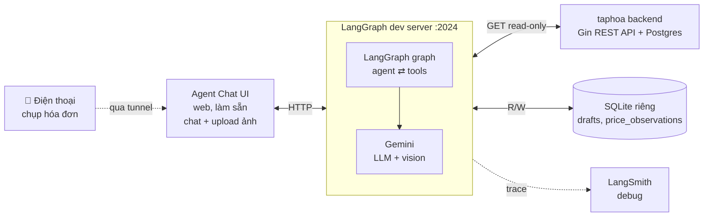

# Spec: Taphoa Chat Agent (POC)

> Ngày: 2026-05-25 · Trạng thái: Draft (chờ review) · Tác giả: thb

## 1. Tổng quan & mục tiêu

Một **chat agent** cho hệ thống quản lý tạp hóa (taphoa-management). Người dùng chat bằng
ngôn ngữ tự nhiên (và **gửi ảnh hóa đơn nhập hàng**) qua một giao diện web; agent trả lời
dựa trên dữ liệu thật của cửa hàng.

**Mục tiêu kép:**

1. **Demo cho mentor** — một POC chạy được, có giao diện, có tính năng "ăn tiền" (đọc ảnh hóa đơn).
2. **Học LangGraph** — đây là yêu cầu chính của team. Code phải hiểu được, không phải copy-paste.

**Không phải mục tiêu:** sản phẩm production hoàn chỉnh, thay thế các trang quản lý hiện có.

## 2. Phạm vi

### v1 (POC này) — LÀM

- **Hỏi-đáp dữ liệu (read-only):** tồn kho, doanh thu, top sản phẩm, cảnh báo hết hàng / hết hạn, công nợ.
- **Flagship — ảnh hóa đơn nhập:** trích xuất dữ liệu từ ảnh →
  - (a) **lưu đơn nhập nháp** (draft) để xem lại;
  - (b) **cảnh báo giá nhập**: so giá trong ảnh với giá vốn hiện tại → tính % thay đổi + ảnh hưởng biên lợi nhuận.

### v1 — KHÔNG làm (chống phình to / giảm rủi ro)

- ❌ Tự động ghi vào kho thật (`POST /purchase-orders`) — để v2.
- ❌ Các hành động ghi khác: tạo hóa đơn bán, sửa sản phẩm, trả hàng.
- ❌ Sửa backend Go (agent tự lưu vào DB riêng).
- ❌ Telegram / Zalo (kênh phụ, để sau).

### v2 (lộ trình sau)

- Thêm bước **human-in-the-loop** (`interrupt`): user xác nhận → biến draft thành đơn nhập thật.
- Thêm các kênh chat khác (Telegram/Zalo) theo pattern platform adapter của caddie-v3.
- Đổi LLM sang Claude (chỉ sửa `llm.ts`).

## 3. Tech stack

| Thành phần | Lựa chọn | Ghi chú |
|---|---|---|
| Ngôn ngữ | TypeScript | Đồng bộ stack b3-mono; tận dụng kiến thức TS sẵn có |
| Framework agent | `@langchain/langgraph` (JS) | Theo pattern `services/caddie-v3` của b3-mono |
| LLM | **Google Gemini** (`@langchain/google-genai`) | Free tier + có vision; tách riêng trong `llm.ts` để sau đổi Claude |
| Validate schema | `zod` | Định nghĩa tham số tool + cấu trúc trích xuất hóa đơn |
| Lưu trữ riêng | SQLite (`better-sqlite3`) | Drafts + price observations; không đụng DB taphoa |
| Giao diện | **Agent Chat UI** (LangChain, làm sẵn) | Hỗ trợ upload ảnh/PDF sẵn; nhìn giống panel caddie-v3 |
| Dev server / debug | `langgraph dev` + **LangGraph Studio** | Xem graph chạy real-time, hot reload |
| Observability | **LangSmith** (tùy chọn, bật) | Trace mỗi lần agent chạy để học + debug |

## 4. Kiến trúc tổng thể



## 5. Cấu trúc thư mục

```
agent/
├── src/
│   ├── llm.ts                 # cấu hình LLM (Gemini; 1 chỗ duy nhất để đổi provider)
│   ├── graph/
│   │   ├── state.ts           # State của graph (messages)
│   │   ├── graph.ts           # dựng + compile StateGraph (export cho langgraph.json)
│   │   └── nodes/
│   │       └── agent.ts       # node LLM + ToolNode (vòng lặp ReAct)
│   ├── tools/
│   │   ├── taphoa-read.ts     # các tool đọc dữ liệu (gọi GET)
│   │   └── invoice.ts         # record_purchase_invoice (trích xuất + so giá + lưu)
│   ├── taphoa/
│   │   └── client.ts          # login lấy JWT + gọi API taphoa
│   └── store/
│       └── drafts.ts          # SQLite: draft_invoices, draft_invoice_items, price_observations
├── langgraph.json             # cấu hình dev server (trỏ tới graph, env)
├── .env.example               # GOOGLE_API_KEY, TAPHOA_*, LANGSMITH_*
├── package.json
└── test-fixtures/             # ảnh hóa đơn thật để test (GITIGNORE)
```

Agent Chat UI: clone repo `langchain-ai/agent-chat-ui` (hoặc dùng bản hosted), trỏ tới
`http://localhost:2024`. Không nằm trong `agent/` để giữ tách bạch.

## 6. Thành phần chi tiết

### 6.1 `graph/state.ts`
State tối thiểu: `messages` (lịch sử hội thoại, dùng `MessagesAnnotation` của LangGraph).
Threads/persistence do `langgraph dev` lo sẵn ở v1.

### 6.2 `graph/nodes/agent.ts` + `graph/graph.ts`
- Node `agent`: gọi `llmWithTools.invoke(state.messages)`. LLM hoặc trả lời, hoặc phát `tool_calls`.
- Node `tools`: dùng `ToolNode` của LangGraph để thực thi tool.
- Conditional edge: sau `agent`, nếu có `tool_calls` → `tools`; ngược lại → `END`.
- Vòng lặp ReAct: `tools` → quay lại `agent`.

### 6.3 `tools/taphoa-read.ts`
Mỗi tool = 1 hàm gọi GET + schema mô tả rõ ràng (để LLM phân biệt). Dự kiến:

| Tool | Gọi endpoint | Dùng khi |
|---|---|---|
| `get_inventory` | `GET /inventory` | hỏi tồn kho, còn bao nhiêu hàng |
| `list_products` | `GET /products` | tra cứu / match sản phẩm |
| `get_low_stock_alerts` | `GET /alerts/low-stock` | sản phẩm sắp hết |
| `get_expiry_alerts` | `GET /alerts/expiry` | sản phẩm sắp hết hạn |
| `get_revenue_report` | `GET /reports/revenue` | doanh thu (KHÁC lợi nhuận) |
| `get_top_products` | `GET /reports/top-products` | sản phẩm bán chạy |
| `get_debts_summary` | `GET /debts/summary` | công nợ khách hàng |

> **Quy tắc description:** mỗi tool ghi rõ *làm gì + khác tool na ná chỗ nào* (vd doanh thu vs lợi nhuận),
> để tránh agent gọi nhầm → trả lời sai mà vẫn trôi chảy (silent wrong answer).

### 6.4 `tools/invoice.ts` — `record_purchase_invoice`
- **Schema = cấu trúc hóa đơn** (Gemini đọc ảnh rồi điền vào = bước "trích xuất"):
  ```ts
  z.object({
    supplierName: z.string(),
    items: z.array(z.object({
      name: z.string(),         // tên đọc trên hóa đơn
      quantity: z.number(),
      unit: z.string(),
      costPrice: z.number(),    // giá nhập 1 đơn vị
      expiryDate: z.string().nullable(),
    })),
  })
  ```
- **Xử lý trong hàm:**
  1. `GET /products` → danh sách SP + `sell_price`.
  2. **Match** mỗi item ảnh ↔ product (so tên gần đúng / fuzzy). Đánh dấu confidence.
  3. Với SP match được: `GET /products/:id/price-history` → giá vốn gần nhất → so với `costPrice` ảnh.
     Tính `% thay đổi` + biên LN cũ/mới (`margin = (sell_price - cost)/sell_price`).
  4. **Lưu** draft + price_observations vào SQLite.
  5. **Return string** tóm tắt: items, cảnh báo giá, item nào CHƯA match (để user kiểm tra).
- **Ambiguity:** ảnh "Coca" mà DB có "Coca lon" + "Coca chai" → **không đoán bừa**, liệt kê cả 2 cho user (v2 dùng interrupt để hỏi chọn).

### 6.5 `taphoa/client.ts`
- `login()`: `POST /auth/login` (user/pass trong `.env`) → lưu JWT.
- Helper `get(path, params)` tự gắn header `Authorization: Bearer <jwt>`, tự login lại nếu hết hạn.

## 7. Dữ liệu

### Đọc live từ taphoa (qua API, không cache lâu)
- `GET /products` → `name`, `sell_price`, `unit`.
- `GET /products/:id/price-history` → giá vốn (`cost_price`) theo từng lô.
- Các endpoint báo cáo / cảnh báo cho phần hỏi-đáp.

### Lưu vào SQLite (của agent)

```sql
draft_invoices(id, supplier_name, created_at, raw_json, status DEFAULT 'draft')
draft_invoice_items(id, draft_id, raw_name, matched_product_id NULLABLE,
                    quantity, unit, cost_price, expiry_date)
price_observations(id, product_id NULLABLE, raw_name, observed_cost_price,
                   previous_cost_price, pct_change, sell_price,
                   old_margin, new_margin, observed_at, source DEFAULT 'invoice_photo')
```

## 8. Giao diện & cách chạy

1. `cd agent && npx @langchain/langgraph-cli dev` → server tại `http://localhost:2024`
   + link mở **LangGraph Studio** (xem graph chạy).
2. Chạy **Agent Chat UI** (clone/hosted) → trỏ `apiUrl=http://localhost:2024`, chọn graph.
3. Chat + upload ảnh ngay trong UI (upload có sẵn).
4. **Dùng trên điện thoại** (để chụp ảnh tiện): mở UI qua **tunnel taphoa sẵn có**; trên mobile,
   nút đính kèm cho phép chụp ảnh trực tiếp.

## 9. Observability — LangSmith

Bật bằng env (`LANGSMITH_TRACING=true`, `LANGSMITH_API_KEY=...`). Mỗi lần agent chạy tự log:
prompt, tool calls, kết quả, token, thời gian. Dùng để **học** (thấy agent suy nghĩ) + **debug**
(vd thấy agent gọi nhầm tool).

## 10. Auth tới taphoa

Agent đăng nhập bằng một tài khoản taphoa (đặt trong `.env`) → JWT → gọi các endpoint cần auth.
v1 dùng tài khoản có sẵn; không xây cơ chế auth riêng.

## 11. Testing

- **Unit test** `taphoa/client.ts` (mock HTTP) và logic cảnh báo giá (% thay đổi, biên LN).
- **Thử tay:** vài câu hỏi đọc dữ liệu + 5–10 **ảnh hóa đơn thật** (đa dạng: in/viết tay, rõ/mờ,
  nhiều NCC). Ảnh để trong `test-fixtures/` (gitignore).
- **Studio/LangSmith:** kiểm tra agent gọi đúng tool, đúng số vòng.

## 12. Rủi ro & caveat

| Rủi ro | Mức độ | Giảm thiểu |
|---|---|---|
| Matching tên SP từ ảnh sai | Trung bình | v1 **không ghi kho thật** → sai chỉ làm cảnh báo sai, không hỏng dữ liệu; ca mơ hồ thì liệt kê thay vì đoán |
| Gemini free rate limit | Thấp | Đủ cho POC; nếu vượt thì chờ hoặc nâng cấp |
| Ảnh hóa đơn gửi lên Google (privacy) | Thấp | Ý thức được; không gửi dữ liệu quá nhạy cảm |
| JWT taphoa hết hạn giữa chừng | Thấp | Client tự login lại |

## 13. LangGraph concepts (mục tiêu học)

StateGraph · state/node/edge · conditional edge · vòng lặp ReAct · tool + schema/description ·
multimodal input (ảnh) · structured extraction · (v2) `interrupt` / human-in-the-loop ·
dev server + Studio + LangSmith tracing.

## 14. Tham chiếu

- `services/caddie-v3/` trong b3-mono — agent LangGraph.js production của team (đọc để học pattern:
  `graph/state.ts`, `graph/main.ts`, `graph/nodes/*`, `tools/factory.ts`, `llm.ts`).
- Agent Chat UI: `langchain-ai/agent-chat-ui`.
- LangGraph dev server (JS): https://docs.langchain.com/oss/javascript/langgraph/local-server
