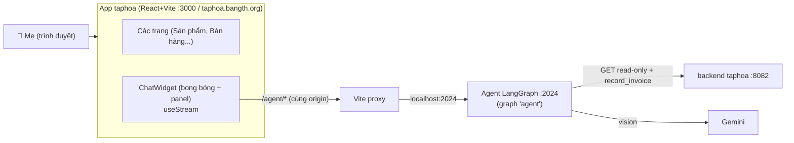

# Spec: Bong bóng "Trợ lý" — nhúng chat agent vào frontend taphoa (Phase 4)

> Ngày: 2026-05-27 · Trạng thái: Draft (chờ review) · Tác giả: thb

## 1. Tổng quan & mục tiêu

Nhúng chat agent (đã build ở Phase 1-3) **trực tiếp vào app quản lý taphoa** dưới dạng **bong bóng chat nổi** — thay vì một web app riêng (`chat-taphoa.bangth.org`). Người dùng (mẹ) ở bất kỳ trang nào (bán hàng, kho, sản phẩm...) đều bấm hỏi được ngay, không phải mở URL riêng hay đăng nhập lần hai.

**Mục tiêu:** tích hợp "dễ dùng" — 1 app duy nhất, chat + **upload ảnh hóa đơn** nằm ngay trong taphoa, giao diện khớp Ant Design hiện có.

**Không phải mục tiêu:** thay thế UI riêng (vẫn giữ để demo/test); sửa logic agent (tái dùng nguyên); deploy agent như service production (xem caveat mục 9).

## 2. Phạm vi

### v1 (spec này) — LÀM
- **Bong bóng nổi** (`FloatButton` 💬 góc phải-dưới) hiện trên **mọi trang** (gắn ở `AppLayout`).
- Bấm → mở **panel chat** (~380×560): danh sách tin nhắn (render markdown) + ô nhập + nút 📎 đính ảnh + gửi.
- **Chat hỏi-đáp** (streaming, hiện chữ dần) — tái dùng toàn bộ read tools của agent.
- **Upload ảnh hóa đơn** ngay trong panel → trích xuất + cảnh báo giá + lưu nháp (tái dùng tool `record_purchase_invoice`).
- **Ẩn tool calls** mặc định → chỉ hiện hỏi + đáp (không lộ JSON thô).
- Giữ hội thoại khi chuyển trang (lưu `threadId` ở `localStorage`) + nút "đoạn chat mới".

### v1 — KHÔNG làm
- ❌ Sửa backend agent (graph/tools/normalize tái dùng y nguyên).
- ❌ Lịch sử nhiều đoạn chat (sidebar threads), tìm kiếm hội thoại.
- ❌ Giọng nói.
- ❌ Cải tiến "agent thông minh hơn" (tinh prompt/thêm tool) — việc riêng, spec khác.
- ❌ Bỏ UI riêng `chat-taphoa.bangth.org` (vẫn giữ).

### v2 (lộ trình sau)
- Deploy agent như service luôn-on để mẹ dùng thật (xem mục 9).
- Lịch sử nhiều đoạn chat.
- Gợi ý câu hỏi nhanh (quick prompts), nút xác nhận biến nháp → đơn nhập thật (`interrupt`).

## 3. Tech stack

| Thành phần | Lựa chọn | Ghi chú |
|---|---|---|
| Frontend | React + Vite + TypeScript + Ant Design | App taphoa hiện có |
| Kết nối agent | `@langchain/langgraph-sdk` (`useStream`) | Hook React chính thức: quản thread + streaming |
| Đường truyền | **Vite proxy** `/agent → http://localhost:2024` | Cùng origin → không CORS; chạy cả local lẫn tunnel |
| Render markdown | thư viện markdown sẵn dùng trong repo (vd `react-markdown`), hoặc thêm nếu chưa có | Cho câu trả lời có bảng/gạch đầu dòng |
| Agent backend | LangGraph.js `:2024` (Phase 1-3) | **Không sửa** |

## 4. Kiến trúc

> Trình duyệt chỉ gọi cùng origin (`/agent`); Vite dev server (Node, chạy local sau tunnel) proxy nội bộ tới `:2024`. Không expose `:2024` ra ngoài, không CORS.

## 5. Thành phần chi tiết (file trong `frontend/src`)

| File | Trách nhiệm |
|---|---|
| `components/chat/ChatWidget.tsx` | Bong bóng `FloatButton` + panel; khởi tạo `useStream`; quản đóng/mở, threadId, "chat mới", lỗi |
| `components/chat/ChatMessage.tsx` | Render 1 tin nhắn (markdown cho assistant, preview ảnh cho tin có ảnh); **bỏ qua** tool call/tool result |
| `components/chat/ChatInput.tsx` | Ô nhập + nút 📎 chọn ảnh (preview thumbnail) + nút gửi; gọi `submit()` |
| `lib/chatImage.ts` | `fileToImageBlock(file)` → `{type:"image", mimeType, data}` (base64, bỏ prefix) — **thuần, có unit test** |
| `components/AppLayout.tsx` | (SỬA) gắn `<ChatWidget/>` để hiện mọi trang |
| `vite.config.*` | (SỬA) thêm `server.proxy['/agent'] → http://localhost:2024` (rewrite bỏ `/agent`) |
| `package.json` | (SỬA) thêm `@langchain/langgraph-sdk` (+ markdown lib nếu thiếu) |

## 6. Luồng dữ liệu

- **Chat chữ:** gõ → `submit({ messages:[HumanMessage(text)] })` → `useStream` nhận token streaming → `ChatMessage` hiện dần.
- **Ảnh:** chọn file → `fileToImageBlock` → `submit({ messages:[{ role:"user", content:[{type:"text",...},{type:"image",mimeType,data}] }] })` → agent `normalize.ts` đổi sang `image_url` → Gemini đọc → tool `record_purchase_invoice` → tóm tắt nháp.
- **Ẩn tool:** widget chỉ render message `assistant` dạng text; bỏ qua message tool-call/tool-result → mẹ thấy chatbot sạch.
- **Thread:** `useStream` giữ `threadId`; lưu `localStorage` (`taphoa_chat_thread`) → chuyển trang không mất hội thoại. "Chat mới" = xoá threadId, tạo thread mới.

## 7. Auth

Agent tự đăng nhập backend taphoa bằng tài khoản trong `agent/.env` (Phase 1). Widget **không** cần truyền JWT của mẹ sang agent. Server agent (`langgraph dev`) local không auth → widget gọi thẳng qua proxy. (Ai mở được app taphoa thì dùng được chat — đủ cho cửa hàng.)

## 8. Lỗi & trạng thái

- Agent offline (`:2024` chưa chạy) → `useStream` onError → panel báo "Trợ lý đang bận, thử lại sau" (không làm vỡ app).
- Ảnh quá lớn → giới hạn kích thước (vd 10MB) + báo nếu vượt.
- Đang chờ trả lời → hiện "đang soạn..." / spinner.

## 9. Caveat deploy (quan trọng)

`langgraph dev` là server **dev**. v1 nhắm **local + tunnel** (agent chạy ở máy thb; mẹ truy cập qua `taphoa.bangth.org`, widget proxy `/agent` về máy thb). Để mẹ dùng **độc lập, luôn-on** cần deploy agent như một service (Docker/PM2/LangGraph Platform) reachable từ frontend — **việc v2**, ngoài phạm vi spec này.

## 10. Testing

- **Unit:** `lib/chatImage.ts` (file→block: mime đúng, base64 bỏ prefix).
- **Thử tay:** mở taphoa → bong bóng → (a) hỏi tồn kho/doanh thu (read tools), (b) upload ảnh hóa đơn → tóm tắt nháp. Test local (`localhost:3000`) + qua tunnel (`taphoa.bangth.org`) + điện thoại.
- Kiểm streaming hiện dần, ẩn tool calls, giữ hội thoại khi chuyển trang.

## 11. Rủi ro & giảm thiểu

| Rủi ro | Mức | Giảm thiểu |
|---|---|---|
| `useStream` cần config khác trong Vite (so với Next) | TB | Dùng proxy cùng origin; đối chiếu cách agent-chat-ui dùng `useStream` |
| Vite proxy không chạy qua tunnel | Thấp | Proxy nằm ở Vite dev server (local, sau tunnel) → cùng origin, đã dùng pattern này cho passthrough chat-ui |
| Style panel lệch AntD | Thấp | Dùng component AntD (FloatButton, Card, Input, Spin) |
| Agent dev server tắt giữa chừng | TB | onError hiển thị thân thiện; không crash app |

## 12. Tham chiếu

- Agent backend: `agent/` (Phase 1-3), `agent/src/graph/normalize.ts` (xử lý block ảnh UI).
- `chat-ui/` (agent-chat-ui đã clone) — đọc `src/providers/Stream.tsx`, `src/lib/multimodal-utils.ts` để học cách dùng `useStream` + format ảnh.
- Spec gốc agent: `docs/superpowers/specs/2026-05-25-taphoa-chat-agent-design.md`.
- Layout gắn widget: `frontend/src/components/AppLayout.tsx`.
